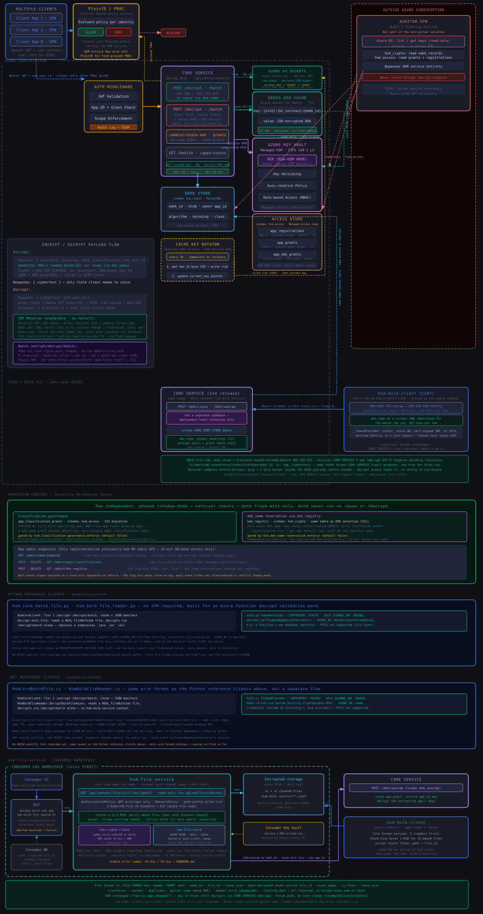
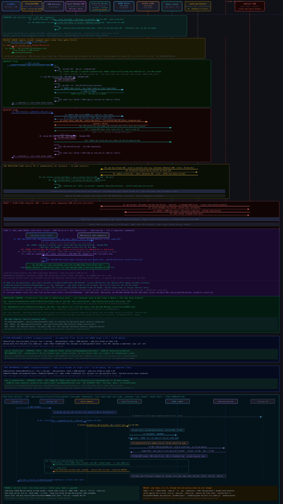

# hsm-file-service

A read-only service that runs **in a consumer's namespace** and serves
decrypted files to that consumer's UI, through the consumer's BFF. It reads
an encrypted file from storage, checks every chunk, reassembles them and
returns the original bytes.

It is the continuous counterpart of `hsm-bulk-client`:

| Module | Role |
|---|---|
| `hsm-crypto-client` | Shared crypto: file format, DEK cache, calls to core. One implementation, used by everything below. |
| `hsm-file-store` | Shared storage adapters: local, ADLS Gen2, Azure Blob. Kept out of `hsm-crypto-client` so the library stays free of the Azure Storage SDKs. |
| `hsm-bulk-client` | Batch: mass encrypt/decrypt of DB columns or files. Runs, then exits. |
| `hsm-file-service` | Continuous: decrypt-and-serve over HTTP, for UIs. |



## Ownership and handover

The core HSM team owns the code. Consumers receive a **signed image and a
versioned Helm chart**, never the source, and they configure the service;
they do not fork it. Security patches (BC-FIPS, Spring, Netty, Azure SDK)
therefore reach every consumer as an image bump.

| Area | Core HSM team | Consumer |
|---|---|---|
| Code, file format, crypto, BC-FIPS | Build, patch, release | Upgrade on release |
| Image + chart | Sign, publish SBOM, keep a compatibility table | Deploy, configure, scale |
| User authorization | Provides the trust model (below) | **The BFF decides which user may see which file** |
| Service identity | Register its `app_id`, create the cross-app grant | Hold the private key in their Key Vault |
| Storage | — | Grant the pod identity *Storage Blob Data Reader* |
| On-call | Second line: format, core, keys | First line: pods, access, error-code triage via `RUNBOOK.md` |

## Access model (option A: trust the BFF)

```
UI ──► BFF ──(mesh mTLS, GET /v1/files/<path>)──► hsm-file-service ──► storage (read)
        │                                            └─────────────► hsm-core-service (/dek/unwrap)
        └── decides which user may see which file
```

The BFF alone decides which user may see which file. The service checks who
is calling and which paths may be served, through these layers:

1. **NetworkPolicy:** only BFF pods reach port 8080, and only monitoring
   reaches 8081.
2. **Istio `PeerAuthentication` STRICT + `AuthorizationPolicy`:** only the
   BFF's service-account principal may `GET /v1/files/*`. The sidecar
   enforces this before the JVM sees the request.
3. **`access.allowed-path-prefixes`** (required): anything else is `404`,
   even when the BFF asks for it.
4. **Optional `access.trusted-caller-spiffe-ids`:** an in-process second
   check of the peer identity Istio puts in `x-forwarded-client-cert`. Enable
   it only inside the mesh.
5. **`X-End-User` is recorded, never trusted.** It goes into the audit line
   and plays no part in allow/deny.

Consequence: the core-service audit trail sees "`<service app_id>`
unwrapped key K". The *end user* appears only in this service's
`file_access` audit line, from the BFF's header.

## API

**Machine-readable contract (OpenAPI 3.1):** `helm/hsm-file-service/openapi.yaml`,
shipped inside the chart. Generate a BFF client from it, or mock the service in
BFF tests. It is produced from the service itself, by springdoc 3.1.x on Spring
Boot 4.1.0. `OpenApiContractTest` fails the build if the running service and the
committed file ever differ, so the file can't go stale. A running pod also
serves it on the management port:

- `/actuator/openapi` (JSON) and `/actuator/openapi.yaml`, always on;
- `/actuator/swagger-ui`, only with `config.swaggerUi: true`. Reach it through
  `kubectl port-forward <pod> 8081`.

The spec is never on the BFF-facing port 8080.

`GET /v1/files/{path}`. This is the only data endpoint: no upload, list or
delete.

| Request header | |
|---|---|
| `X-Expected-File-Id` | The `file_id` the BFF recorded (from bulk-client's result files). A mismatch is `412`. Required when `access.require-expected-file-id=true`. |
| `X-End-User` | Who the BFF is serving. Audit only. |
| `X-Request-Id` | Correlation id; generated if absent; echoed back. |

| Response header | |
|---|---|
| `Content-Type` | From the file extension, else `application/octet-stream`. Always sent with `X-Content-Type-Options: nosniff`. |
| `Content-Disposition` | `inline` (default) or `attachment`, with the file name |
| `Cache-Control: no-store`, `Pragma: no-cache` | Always: decrypted content must never be cached by proxies or browsers |
| `Content-Length` | Buffered mode only |
| `X-HSM-Format-Version` | `1` or `2` |
| `X-HSM-File-Id` | v2 files |
| `X-HSM-Delivery` | `buffered` or `streaming` |



### Delivery modes: what the BFF must handle

| Stored (encrypted) size | Mode | On failure |
|---|---|---|
| ≤ `delivery.buffer-threshold-bytes` (21.5 MiB stored, about 16 MiB original) and a buffer slot free | **buffered**: the whole file is verified in memory before the first byte | Clean JSON error. The client never sees partial content. |
| Larger, or no slot free within `buffer-acquire-timeout` | **streaming**: each chunk is sent once it is verified | Before the first byte: clean JSON error. After it: **the connection is aborted.** |

**The BFF must treat an aborted or incomplete download as a failure and never
show it.** Streamed responses carry no `Content-Length` (chunked transfer),
so an abort is unambiguous: the HTTP client reports an error, never a short,
normal response. `FileServiceIntegrationTest.streamedFile_failingAfterBytesWereSent_abortsTheConnection`
pins this behaviour.

`delivery.max-buffered-requests` (default 32) bounds heap use from bursts of
small files. Past it, small files stream instead of waiting.

### Error codes

The body is always `{"error_code": "...", "message": "...", "request_id": "..."}`
with a fixed message. Details are in the service log, under the same
`request_id`.

| Code | HTTP | Meaning | First thing to check |
|---|---|---|---|
| `FS-400-BAD-PATH` | 400 | Empty, over-long, `..`/`.` segments, `//`, backslash, control characters | BFF path building |
| `FS-400-BAD-FILE-ID` | 400 | `X-Expected-File-Id` is not a UUID | BFF |
| `FS-403-CALLER-NOT-TRUSTED` | 403 | Peer SPIFFE id not in `trusted-caller-spiffe-ids` | Chart values vs BFF service account |
| `FS-404-NOT-FOUND` | 404 | Missing, outside `allowed-path-prefixes`, or bulk bookkeeping (`.hsm_bulk_*`) | Path, prefixes |
| `FS-412-FILE-ID-MISMATCH` | 412 | Stored file is not the one the BFF expects: replaced, restored from an old copy, or the BFF's record is stale | **Security-relevant**: compare with bulk-client result files |
| `FS-412-NO-FILE-ID` | 412 | Expected id given, but the file is v1 | Re-encrypt as v2, or stop sending the header for v1 data |
| `FS-428-FILE-ID-REQUIRED` | 428 | `require-expected-file-id=true` and no header | BFF |
| `FS-422-INTEGRITY` | 422 | Truncated, reordered, spliced, downgraded, bad tag, malformed | **Security-relevant**: storage writes, and whether the file came from a real job |
| `FS-422-LIMIT` | 422 | Frame or chunk over `limits.*` | Chunk size the file was written with |
| `FS-502-KEY-UNAVAILABLE` | 502 | Core refused the unwrap: missing cross-app grant, key shredded, app deactivated | `GET /admin/grants`, app status |
| `FS-502-STORAGE` | 502 | Storage read failed | Storage RBAC, private endpoint, throttling |
| `FS-503-CORE-UNAVAILABLE` | 503 | Core unreachable or returned an HTTP error | hsm-core-service health |
| `FS-500-INTERNAL` | 500 | Anything else | Logs by `request_id` |

Codes are never renumbered, only added.

## Configuration reference

Every value can be set in the chart's `values.yaml` (under `config`), and
each maps to an environment variable and a property under
`hsm.file-service`.

| values.yaml | Default | Notes |
|---|---|---|
| `config.core.baseUrl` | **required** | hsm-core-service URL |
| `config.core.appId` | **required** | This service's own app_id, not the encrypting app's |
| `config.core.authMode` | `AZURE_AD` | `AZURE_AD` / `SELF_SIGNED_JWT` / `MTLS` / `STATIC` (dev) |
| `config.core.azureTokenScope` | required for AZURE_AD | |
| `config.store.type` / `root` | `AZURE_BLOB` / **required** | Same URI forms as bulk-client |
| `config.access.allowedPathPrefixes` | **required** | `["*"]` allows everything, explicitly |
| `config.access.requireExpectedFileId` | `false` | Recommended `true` where files belong to specific users |
| `config.access.trustedCallerSpiffeIds` | `[]` | Mesh only |
| `config.delivery.bufferThresholdBytes` | `22544384` | Stored bytes |
| `config.delivery.maxBufferedRequests` | `32` | |
| `config.delivery.bufferAcquireTimeout` | `100ms` | |
| `config.delivery.contentDisposition` | `inline` | |
| `config.limits.maxFrameBytes` | `16777216` | Accepts chunks up to about 11.9 MiB (bulk's 8 MiB default fits) |
| `config.limits.maxChunkPlaintextBytes` | `12582912` | |
| `config.dekCache.ttl` | `15m` | **Also the revocation lag**: a revoked or shredded key keeps serving for up to TTL + 60 s |
| `config.dekCache.maxSize` | `200` | |
| `config.swaggerUi` | `false` | Swagger UI on the management port; the spec itself is always served there |
| `secrets.keyVault.*` / `secrets.existingSecretName` | Key Vault CSI | Private key (plus signing key or mTLS cert/key) mounted as files under `/mnt/secrets/hsm` |

The chart refuses to render (`helm install` fails) without the required
values, an `AuthorizationPolicy` principal, and a key source.

## Key cache

The service keeps unwrapped DEKs in memory, keyed by `edek_id`: 15-minute TTL,
200 entries, zeroed on eviction and on shutdown. There is no Redis. Each file
read works on a private copy of the key, so an eviction mid-download can't
break a long stream. The cost of a miss is one `/dek/unwrap` round trip. With
named DEKs (one per dataset) the hit rate is close to 100%; with one DEK per
file the cache mostly helps re-opens.

## Running it

| | |
|---|---|
| Ports | 8080: file API (BFF only). 8081: `/actuator/health/{liveness,readiness}`, `/actuator/prometheus`, `/actuator/metrics`, `/actuator/openapi` (+ `/actuator/swagger-ui` when enabled) |
| Metrics | `hsm_file_requests_total{outcome,code,mode,format}`, `hsm_file_request_duration_seconds`, `hsm_file_bytes_served` |
| Audit | One JSON line per request on the `audit.json` logger: `event=file_access`, `request_id`, `outcome` (`ok` / `error` / `aborted` / `client_closed`), `error_code`, `mode`, `path`, `end_user`, `caller`, `file_id`, `format_version`, `bytes`, `duration_ms` |
| Shutdown | Graceful: in-flight downloads get `config.shutdownGrace` (30 s), then the key cache is zeroed. `terminationGracePeriodSeconds` 45. |
| Hardening | Distroless nonroot (65532), read-only root filesystem, all capabilities dropped, seccomp `RuntimeDefault`, `-XX:-HeapDumpOnOutOfMemoryError`, `-XX:+DisableAttachMechanism`, `/tmp` as a 64 Mi memory `emptyDir`. Nothing writes plaintext to disk. |

**Sizing.** Heap is 75% of the memory limit (2 Gi by default). The budget is
`maxBufferedRequests × ~16 MiB` for verified small files, plus about 4 MB per
concurrent streamed download with 1 MiB chunks (about 30 MB with bulk's 8 MiB
default). Write UI-bound files with `FILE_CHUNK_SIZE_BYTES=1048576`
(`FILE_FORMAT.md`, "Chunk size").

## Onboarding checklist

See `APP_ONBOARDING.md`, "hsm-file-service", for the exact steps:

1. Register the service's `app_id` with scope `dek_unwrap` and its public key.
2. Grant it `decrypt` on the encrypting app's keys (`POST /admin/grants`, or
   `/admin/dek-grants` for one `dek_name`). Without the grant, every request
   is `FS-502-KEY-UNAVAILABLE`.
3. Put the private key in the consumer's Key Vault.
4. Give the pod identity *Storage Blob Data Reader* on the container.
5. Install the chart with the BFF's principal, path prefixes and core URL.
6. Smoke test from the BFF pod (the chart's `NOTES.txt` prints the command).
7. If the BFF will send `X-Expected-File-Id`: load `file_id`s from the
   bulk-client result files (`<target>/.hsm_bulk_results/**.jsonl`) into the
   consumer's database.

## Versioning and compatibility

The chart version and the app version move together.

- **Minor:** new optional values or error codes.
- **Major:** a value renamed or removed, or a behaviour change the consumer
  must act on.

| hsm-file-service | Reads formats | hsm-core-service API |
|---|---|---|
| 1.0.x | v1, v2 | `/api/sensec/hsm/v1` `POST /dek/unwrap` |

## Release and supply chain

Build: `java/docker/Dockerfile.hsm-file-service`. It has digest-pinned base
images and uses distroless `java21-debian13:nonroot`. Each release must:

- sign the image (cosign) and attach an SBOM;
- publish the digest in the release notes, which consumers pin through
  `image.digest`;
- grant registry pull access per consumer.

The signing and pull-access steps belong to the core team's release pipeline,
which is outside this repo.

## Known limits and follow-ups

- **No byte-range requests** yet. v2 records `chunk_size`, so ranges can be
  added without a format change. Uncompressed v2 frame offsets are computable
  from it.
- **No circuit breaker** in front of core: each request whose key isn't
  cached calls `/dek/unwrap`, with a 30 s timeout, and returns `503` on
  failure. Add one if core latency spikes become a real problem.
- The end user is not in core's audit trail (see Access model). Adding it
  would be a core-service change.
- `HEAD` is not implemented.
