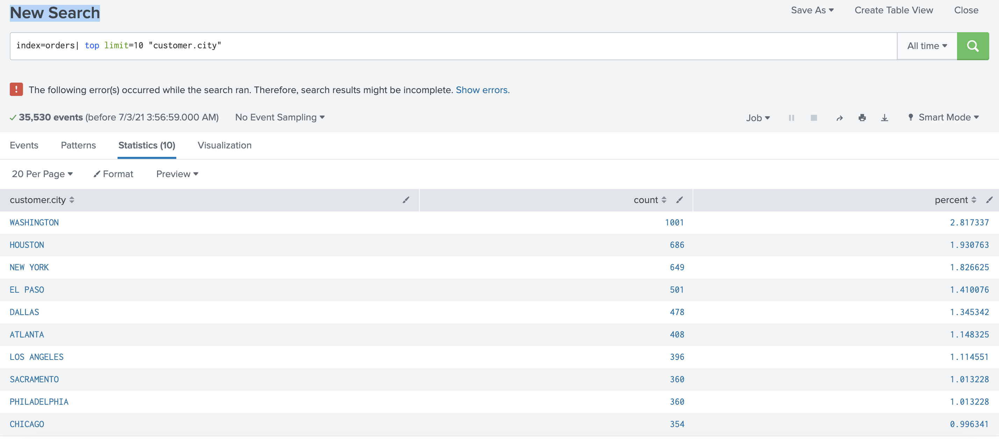

# Splunk over HDFS Data Visualization

## Introduction:
The purpose is to evaluate Splunk integration with external component HDFS but Splink integration is beyond HDFS like RDBMS, Kafka and Nifi. Splunk has the ability to index, search, visualize and analyze the pre-populated data with additional lookup features. The evaluation is completed using widely available docker containers with different set of images. The containers are mainly hadoop services (namenode, datanode, resourcemanager, nodemanager and historyserver) and splunk with support of additional image containers.

Splunk datasplit logic depends on the Hadoop's InputFormat implementation, which means all the InputFormat based data is supported. However Splunk provides new datasplit generator to work wtih Hive and Parquet files. Splunk Analytics for Hadoop currently supports 4 Hive (v0.12) file format types: Textfile, RCfile, ORC files and Sequencefile.

## HDFS Data:

### AVRO Format:

{"platform": "android", "device": "Samsung Galaxy S6", "build": 2470, "created": 1501512849, "error": "Error 7", "ip": "107.115.121.147", "type": "error", "appVersionName": "3.9"}

### JSON Compressed Format:

{"customer": {"city": "AUSTIN", "zip": "78720", "firstName": "ADRIAN", "accountNumber": "901109767", "lastName": "GRIMES", "address": "6871 Walnut Grove Ave.", "phone": "2469004836", "state": "TX", "sex": "M", "age": "48"}, "timestamp": "2013-09-04T06:01:01", "servername": "cupcake.1.woc.com", "charactertype": "Milk Maid", "items": [{"category": "cheese", "itemid": "SC-MG-G10", "price": 20.0, "description": "Roquefort"}, {"category": "armor", "itemid": "DB-SG-G01", "price": 25.0, "description": "'Vegan Friendly Gloves'"}], "total": 45.0, "type": "purchase", "region": "Limburgerland"}

## Splunk Data Visualizations using search:

### Top 20 IPs:

### Top 10 Customer Cities:

## Splunk Hadoop Jobs:

### Hadoop Jobs:

Splunk runs YARN jobs and places the index and search results into HDFS Work directory

## Hadoop Connection:

### Provider:

## Index Definitions:

### AvroData index:

### Orders index:

